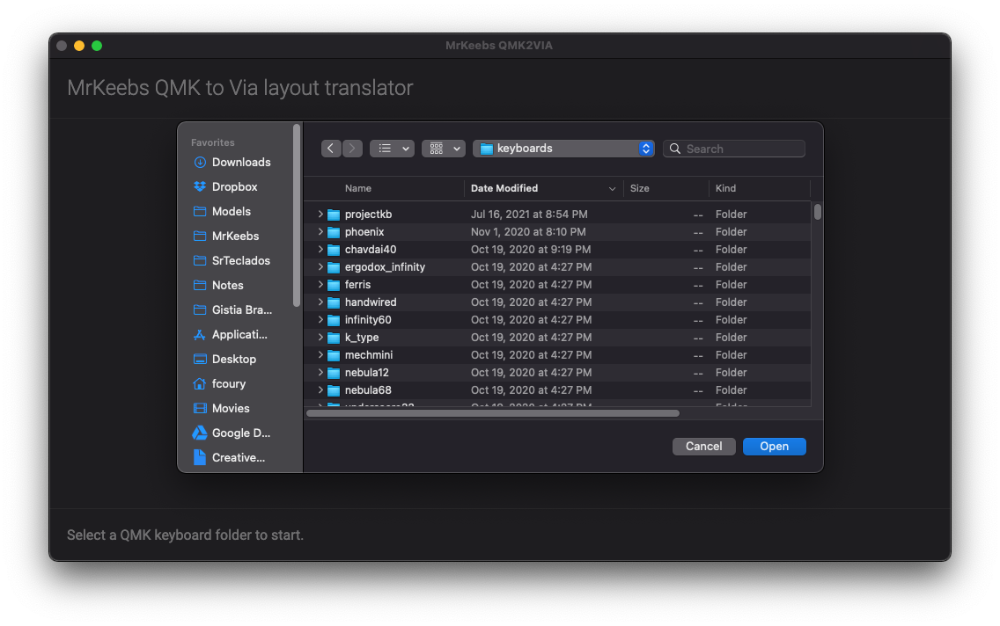
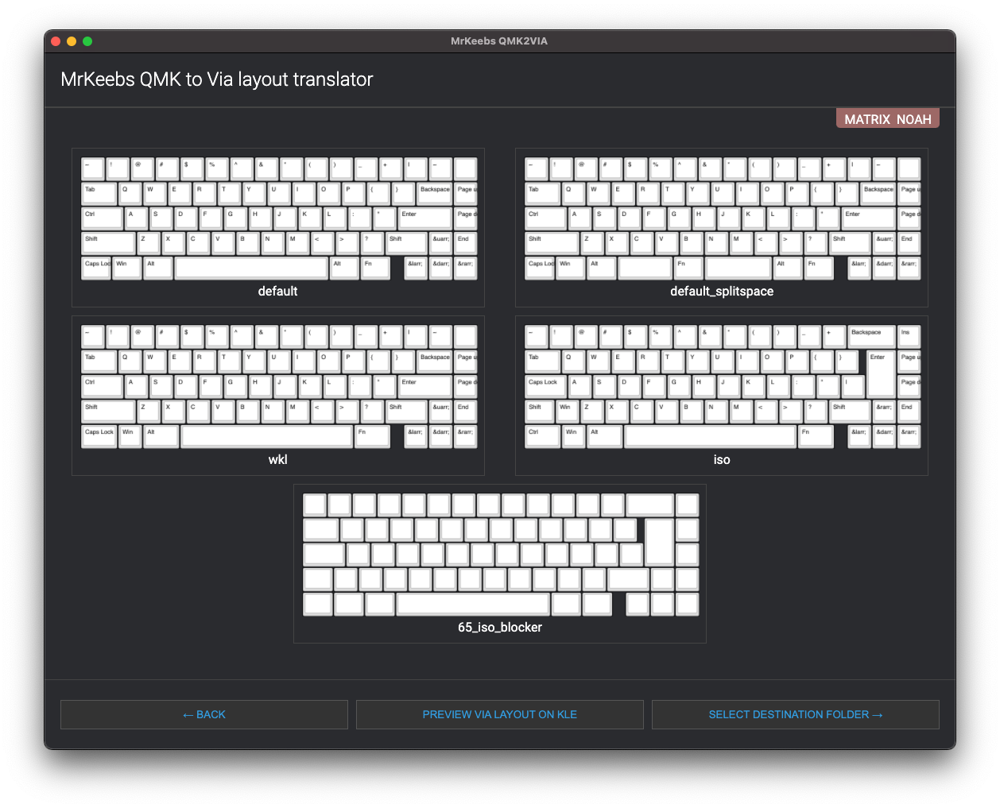
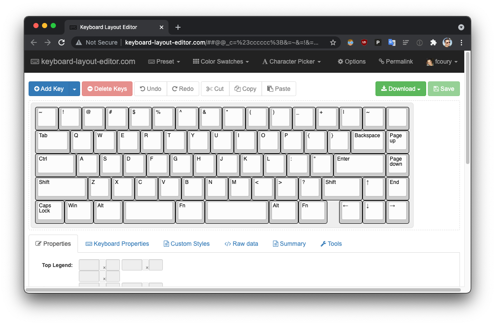
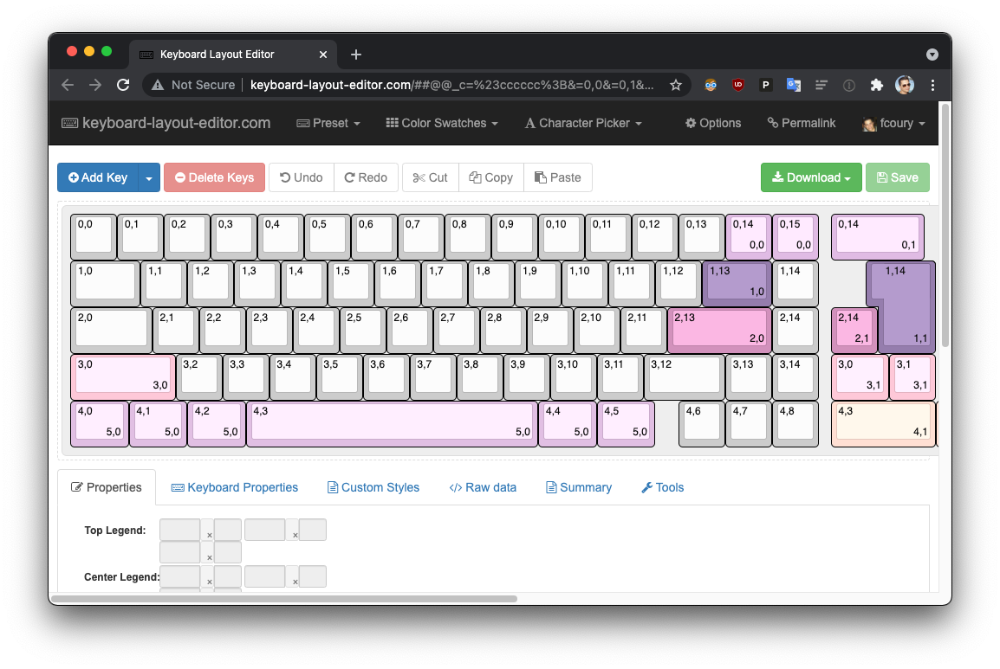
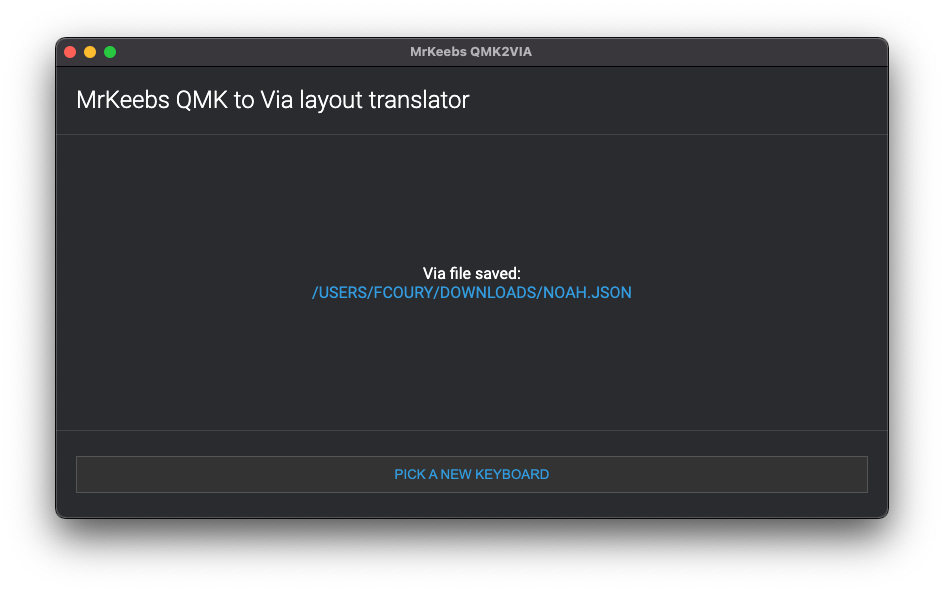
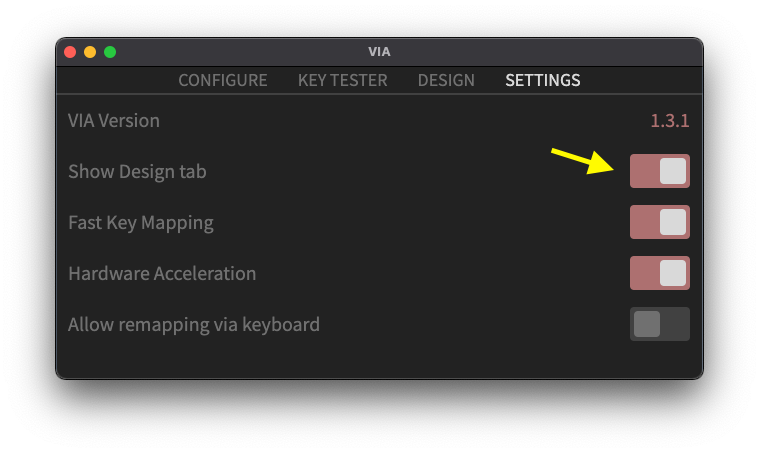
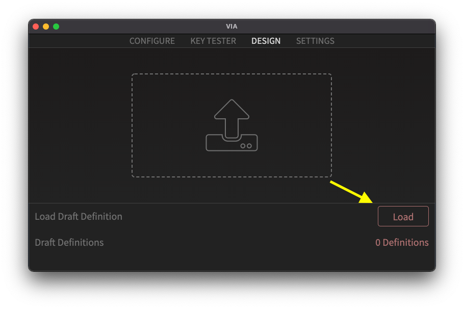
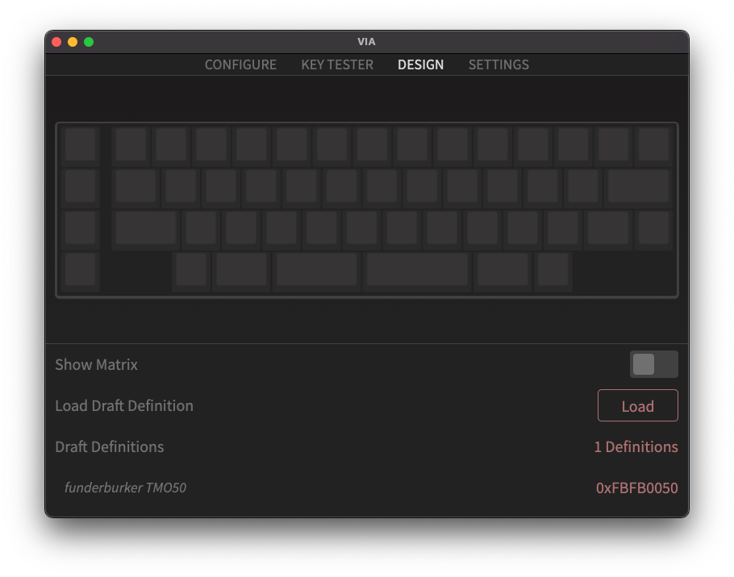

# QMK to VIA Layout converter

This tool uses a QMK keyboard folder to generate the JSON file necessary to load your keyboard into VIA. It also allows you to reverse engineer the KLE layout from the same QMK keyboard folder.

In order for a given folder to be recognized as valid, it needs to have the matrix header (`<board-name>.h`), the config file (`config.h`) and the layout JSON file (`info.json`).

## Usage

Download the [latest release](https://github.com/misterkeebs/qmk2via/releases/latest) (only Win/macOS supported for the time being), install it and execute it.

The first thing it will show is a directory picker:



Once you select a valid folder, the tool will parse the files and display a graphical representation of each  detected layout:



From this screen, if you click one of the layouts, it will open the layout on the Keyboard Layout Editor website, preloading the layout:



You can also use the **Preview VIA Layout on KLE** to check how the generated VIA layout will look like before continuing:



Finally, when you click **Select Destination Folder** another directory picker dialog will open, and you'll be given a chance to select the folder where you want your final JSON file to be saved.



Next step is to go to VIA, click the **Settings** tab and toggle the **Show Design tab** option, making sure it's on:



Finally, click the **Design** tab and click the **Load** button:



Select the file you saved beforehand and it should open on VIA:



And you're done. Just plug in the keyboard and VIA should work automatically.

## Building in Windows

Electron is apparently having a lot of issues with building dependencies, so a little bit of work is needed:

```
cd node_modules/canvas
npm i nan@2.14.0
cd ../..
yarn run electron-rebuild
```
