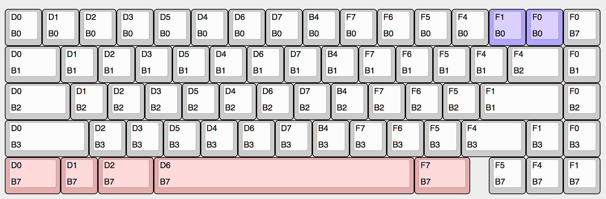
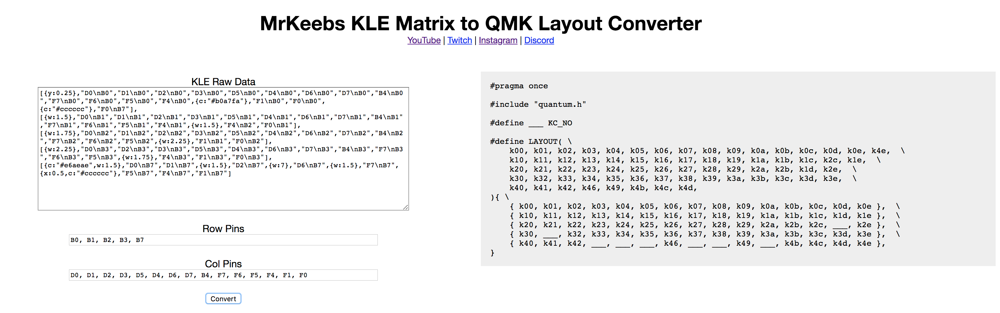

# KLE Matrix to QMK Layout Converter

This project allows a quick generation of the QMK layout source code from a Keyboard Layout Editor layout describing the Row and Column of each key on the keyboard matrix.

In order to create the layout source code, you have to create the row/col layout using MechMerlin's format where you have the Column pin on the top left and the Row pin on the bottm left of the key legend area, like below:



The KLE raw data for this example would be like below:

```
[{y:0.25},"D0\nB0","D1\nB0","D2\nB0","D3\nB0","D5\nB0","D4\nB0","D6\nB0","D7\nB0","B4\nB0","F7\nB0","F6\nB0","F5\nB0","F4\nB0",{c:"#b0a7fa"},"F1\nB0","F0\nB0",{c:"#cccccc"},"F0\nB7"],
[{w:1.5},"D0\nB1","D1\nB1","D2\nB1","D3\nB1","D5\nB1","D4\nB1","D6\nB1","D7\nB1","B4\nB1","F7\nB1","F6\nB1","F5\nB1","F4\nB1",{w:1.5},"F4\nB2","F0\nB1"],
[{w:1.75},"D0\nB2","D1\nB2","D2\nB2","D3\nB2","D5\nB2","D4\nB2","D6\nB2","D7\nB2","B4\nB2","F7\nB2","F6\nB2","F5\nB2",{w:2.25},"F1\nB1","F0\nB2"],
[{w:2.25},"D0\nB3","D2\nB3","D3\nB3","D5\nB3","D4\nB3","D6\nB3","D7\nB3","B4\nB3","F7\nB3","F6\nB3","F5\nB3",{w:1.75},"F4\nB3","F1\nB3","F0\nB3"],
[{c:"#e6aeae",w:1.5},"D0\nB7","D1\nB7",{w:1.5},"D2\nB7",{w:7},"D6\nB7",{w:1.5},"F7\nB7",{x:0.5,c:"#cccccc"},"F5\nB7","F4\nB7","F1\nB7"]

```

Then basically all you need to do is paste it into the tool. As soon as you exit the text area, the tool will try to guess the row and col pins from the raw data. After clicking the **Convert** button, you will be presented with the QMK layout source code, like below:



Then finally all you have to do is copy the code into your keyboard's `keyboard.h` file.